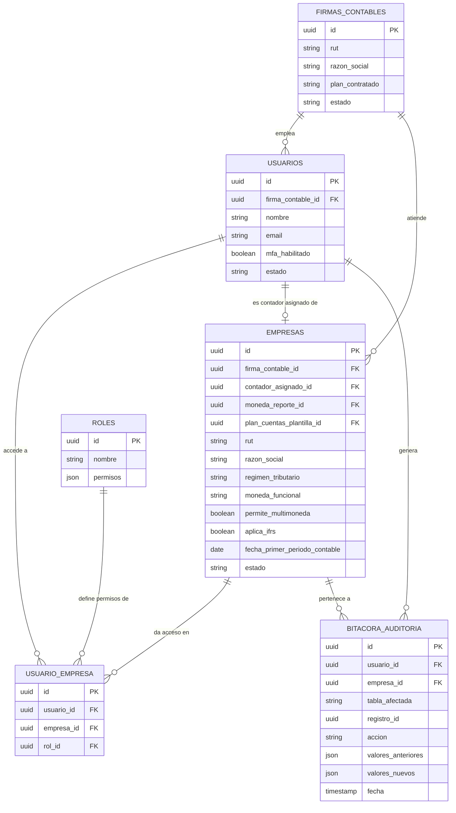
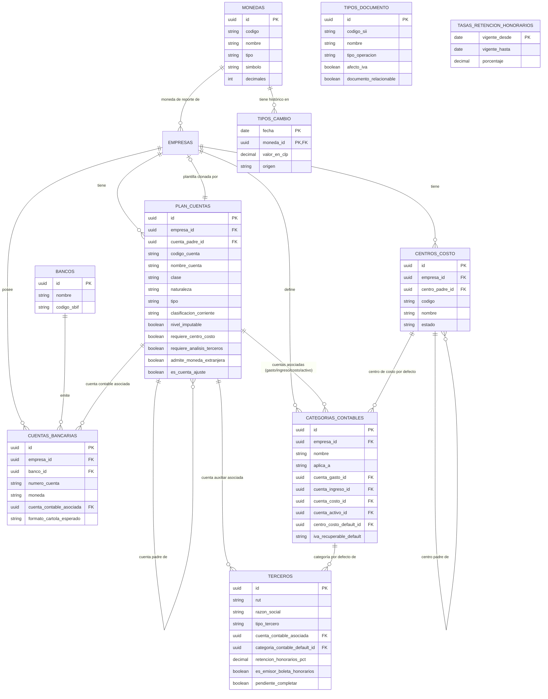
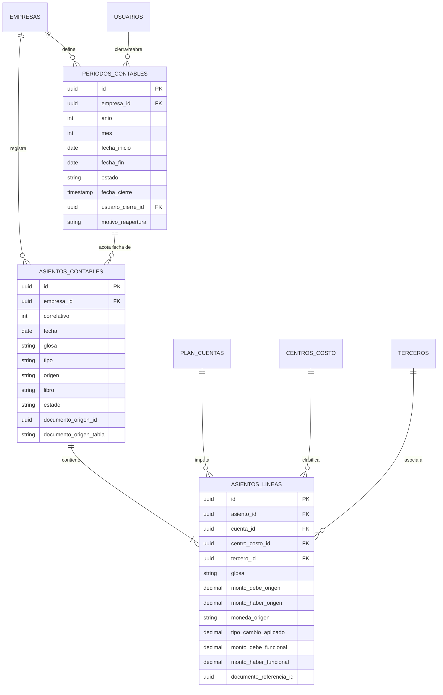
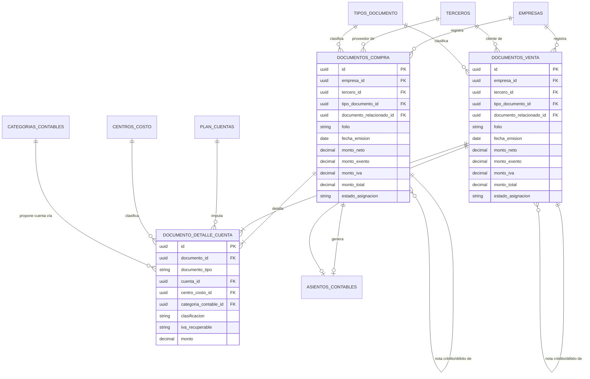
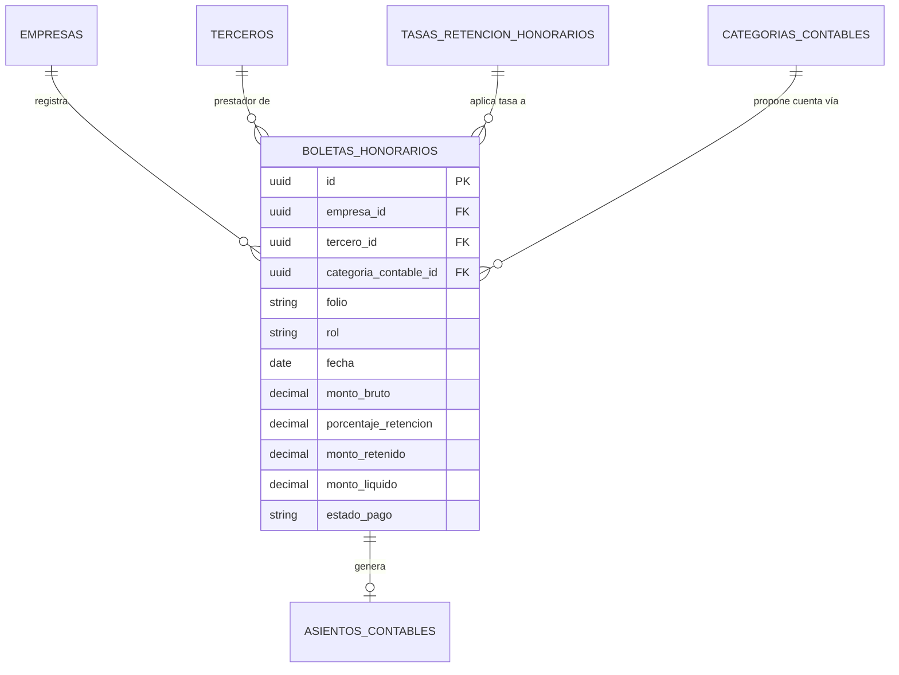
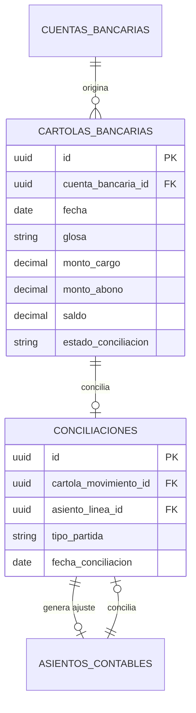
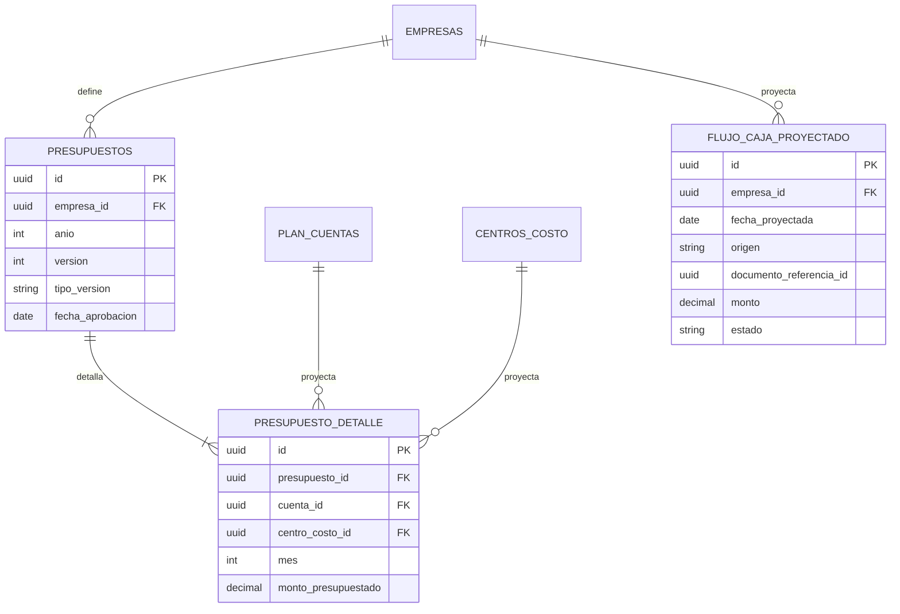
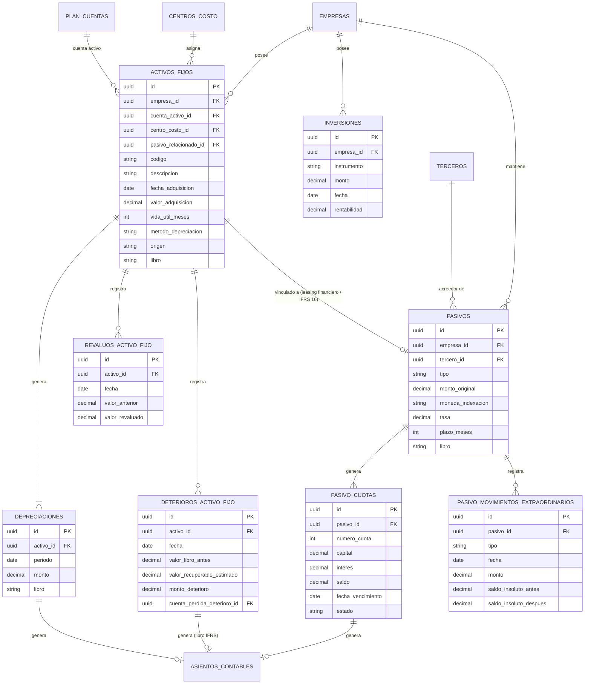
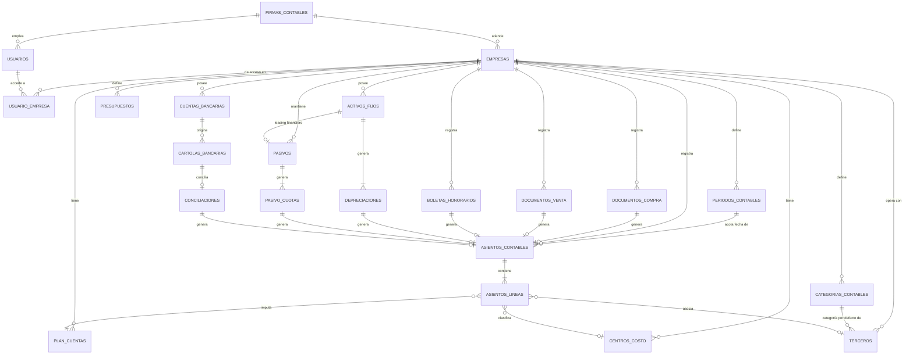

# Diagrama Entidad-Relación — ERP Contable Multiempresa
**Versión:** 0.7 — complementa el documento "Diseño Técnico ERP Contable v0.9"

> **Cambio respecto a v0.6**: se agrega soporte IFRS mediante el campo **`libro`** (Tributario/IFRS/Ambos) en `ASIENTOS_CONTABLES`, `ACTIVOS_FIJOS`, `DEPRECIACIONES` y `PASIVOS`, activable por empresa vía `EMPRESAS.aplica_ifrs`. Se agrega `PLAN_CUENTAS.clasificacion_corriente` (para el balance clasificado) y la entidad `DETERIOROS_ACTIVO_FIJO` (IAS 36).
**Formato:** Mermaid (`erDiagram`). Se puede visualizar pegando cada bloque en https://mermaid.live, en la extensión de Mermaid de VS Code, o directamente en GitHub/GitLab (que renderizan mermaid en markdown).

> **Cambio respecto a v0.1**: se agrega `FIRMAS_CONTABLES` como entidad de nivel superior. El software es usado por una firma de contabilidad (el cliente real) que atiende una cartera de `EMPRESAS` (clientes). Los `USUARIOS` pertenecen a la firma, no "sueltos" en el sistema.
>
> El modelo completo se dividió en 8 diagramas por dominio funcional para que sean legibles. Al final se incluye un diagrama de "mapa general" solo con las entidades y sus relaciones principales, sin atributos, para ver el conjunto completo de una vez.

---

## 1. Núcleo — firma contable, cartera de empresas y seguridad

---

## 2. Tablas maestras

---

## 3. Núcleo contable (asientos)

> `documento_origen_id` / `documento_origen_tabla` en `ASIENTOS_CONTABLES` es la referencia polimórfica hacia el documento que generó el asiento automático (factura, boleta de honorarios, movimiento de cartola, cuota de depreciación, cuota de préstamo). Se usa para bloquear la edición directa (regla de 2.3 del documento de diseño) y para poder regenerar el asiento si el documento origen se corrige.

---

## 4. Compras y ventas (RCV del SII)

> Llave única de negocio (no representable directamente en el ERD): `(empresa_id, tercero_id, tipo_documento_id, folio)` para detectar duplicados en la importación.

---

## 5. Honorarios

---

## 6. Bancos y conciliación

---

## 7. Presupuesto y flujo de caja

---

## 8. Activo fijo, inversiones y pasivos

---

## 9. Mapa general (solo entidades y relaciones principales)

---

## Notas de implementación

- **Referencias polimórficas**: `ASIENTOS_CONTABLES.documento_origen_id` + `documento_origen_tabla` no se pueden expresar como FK real en la mayoría de motores relacionales sin una tabla intermedia. Alternativa más limpia para PostgreSQL: una tabla `asiento_documento_origen (asiento_id, tabla, registro_id)` sin FK físico a la tabla variable, validada por trigger o a nivel de aplicación.
- **Llave única adicional**: `plan_cuentas.clase` solo es asignable cuando `cuenta_padre_id IS NULL` (nivel 1); a nivel de aplicación o trigger, cada cuenta hija debe heredar automáticamente la `clase` de su raíz para mantener el árbol auto-consistente.
- **Llaves únicas de negocio** (no siempre representables en el ERD visual, pero deben ir como `UNIQUE` en el DDL):
  - `documentos_compra` / `documentos_venta`: `(empresa_id, tercero_id, tipo_documento_id, folio)`.
  - `plan_cuentas`: `(empresa_id, codigo_cuenta)`.
  - `indicadores_economicos`: `(fecha, indicador)`.
  - `empresas`: `(firma_contable_id, rut)` — el mismo RUT no debería repetirse dos veces dentro de la cartera de una misma firma.
- **`firma_contable_id` no se propaga a las tablas transaccionales**: basta con que viva en `empresas`. Para filtrar por firma (ej. en los informes de control interno de 4.8) se hace un join a través de `empresa_id`, evitando duplicar la columna de tenancy en decenas de tablas.
- **Particionamiento sugerido**: `asientos_lineas`, `documentos_compra`, `documentos_venta` y `cartolas_bancarias` son las tablas de mayor crecimiento; conviene particionarlas por `empresa_id` + año desde el inicio.
- Todas las tablas transaccionales (no solo maestras) deben incluir `created_at`, `updated_at` y `created_by` además de lo registrado en `bitacora_auditoria`, para trazabilidad básica sin tener que consultar la bitácora en cada caso.
- **Doble libro IFRS**: el campo `libro` en `asientos_contables` (y su reflejo en `activos_fijos`, `depreciaciones`, `pasivos`) es la única pieza estructural que necesita el modelo de doble libro. Todo query de reportes debe filtrar explícitamente por `libro` (`IN ('Tributario','Ambos')` o `IN ('IFRS','Ambos')` según corresponda) — un error común es olvidar este filtro y mezclar ambos libros en un mismo informe, duplicando o contaminando saldos. Se recomienda encapsular este filtro en una vista de base de datos por libro (`vista_saldos_tributario`, `vista_saldos_ifrs`) en vez de repetirlo en cada query de la aplicación.
- **Recomendación de implementación temprana**: agregar el campo `libro` al esquema desde el primer día de construcción del núcleo contable (con valor por defecto `'Ambos'`), aunque el primer cliente no use IFRS — es una columna con default, de costo casi nulo agregarla ahora, y mucho más cara de introducir después sobre una tabla `asientos_contables` ya con datos de producción.
